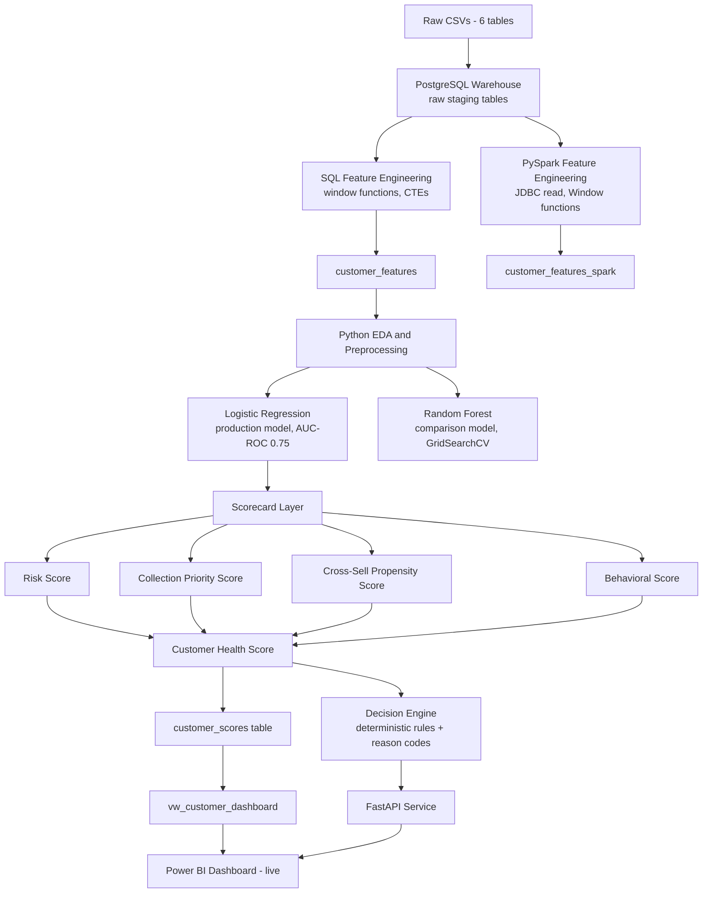

# Customer 360 Intelligence System

A Customer 360 Risk, Scorecard, and Decision Intelligence Platform for retail lending — combining **SQL and PySpark feature engineering**, an **interpretable Logistic Regression risk model** (with a Random Forest comparison), a **five-scorecard business layer** (Risk, Collection Priority, Cross-Sell, Behavioral, and composite Health), a **deterministic decision engine**, a **FastAPI service**, and a **live-connected Power BI dashboard**.

Built around a real customer lifecycle: from underwriting through portfolio management, collections, cross-sell, and retention — each stage backed by a specific score, not a single one-size-fits-all number.

---

## 1. Business Problem

A retail lender's data usually sits in silos: underwriting looks at demographics, collections looks at payment history, and cross-sell looks at income — three teams, three disconnected views of the same customer. This project builds **one customer feature store** feeding a **scorecard layer** and a **deterministic decision engine**, so risk, collections, and cross-sell decisions are consistent, auditable, and traceable to explicit reason codes — not three disconnected models.

**Why trend-based features, not just static demographics:** static data tells you who a customer is; trend-based behavioral data tells you how they're changing — a customer who looks fine today but has a sharply worsening payment trend is a materially different risk than one who's been stable, even with an identical current snapshot.

---

## 2. Dataset

[Home Credit Default Risk](https://www.kaggle.com/c/home-credit-default-risk) (Kaggle), 6 tables. `bureau_balance` is deliberately excluded — no valid join path back to `SK_ID_CURR` without the missing `bureau.csv` bridge (see [`docs/er_diagram.md`](docs/er_diagram.md)).

---

## 3. Architecture



**Why PostgreSQL as the single feature store:** both the SQL and PySpark pipelines read from the same raw staging tables and write to the same database — one source of truth, two engineering approaches, directly comparable.

**Why PySpark alongside SQL, not replacing it:** demonstrates scalable, distributed feature engineering (Window-function-based trend features expressed in Spark's DataFrame API, reading via JDBC) as the dataset's raw tables grow past what's comfortable in a single process's memory (`installments_payments` alone is ~13.6M rows). The production model is currently trained on the SQL-derived `customer_features` table — documented honestly, not silently swapped, since the SQL pipeline has been validated longer. `customer_features_spark` is a real, independently-run, tested parallel pipeline over the same raw data.

---

## 4. Scorecard Architecture

Five scorecards, each a pure, unit-tested function — see `src/scorecards/`:

| Scorecard | Formula | Band Cutoffs |
|---|---|---|
| **Risk** | Model probability x 100 | Low <30, Medium 30-60, High ≥60 |
| **Collection Priority** | Risk Score x normalized loan exposure | URGENT ≥25, ELEVATED ≥10, NORMAL below |
| **Cross-Sell / Propensity** | Rule-based: Risk <20 AND zero late payments AND utilization <40% | Eligible / Not Eligible |
| **Behavioral** *(new)* | `100 - 40×late_payment_rate - min(missed×5,20) - min(avg_DPD,20) - 10×worsening_trend_flag` | Strong ≥75, Fair 50-74, Weak <50 |
| **Health** (composite) | `0.40×(100-Risk) + 0.25×Behavioral + 0.20×(100-Collection) + 0.15×CrossSell` | Healthy ≥80, Monitor 55-80, High Risk <55 |

Full weight/threshold reasoning is documented in each module's docstring — not arbitrary numbers. Band cutoffs were chosen from the actual score distributions produced on the full scored portfolio, validated by monotonically increasing observed default rates across bands.

---

## 5. Decision Engine

Deterministic rules (`src/decision/decision_engine.py`), explicitly separate from the ML model — a risk committee can audit or adjust the decision logic without retraining anything.

```
Customer Features → ML Model → Scores → Decision Engine → Action + Reason Codes
```

| Condition | Action |
|---|---|
| High Risk band, or Collection Priority = URGENT | `COLLECTION_INTERVENTION` |
| Medium Risk band | `MANUAL_REVIEW` |
| Low Risk + Cross-Sell Eligible | `CROSS_SELL_OPPORTUNITY` |
| Low Risk, not cross-sell eligible | `RETENTION_ENGAGEMENT` |

Every decision carries explicit `reason_codes` (e.g. `HIGH_DPD`, `MISSED_PAYMENTS`, `WORSENING_PAYMENT_TREND`) — no unexplained black-box output. Real verified examples in [`docs/tessaract_alignment.md`](docs/tessaract_alignment.md).

---

## 6. Customer Lifecycle Mapping

| Stage | Score | Supported? |
|---|---|---|
| Acquisition | — | ❌ Not in this dataset (documented, not fabricated) |
| Underwriting | Risk Score | ✅ |
| Portfolio Management | Behavioral Score | ✅ |
| Collections | Collection Priority Score | ✅ |
| Cross-Sell | Propensity Score | ✅ |
| Retention | Health Score | ✅ |

---

## 7. Model Development

**Baseline (production): Logistic Regression** — `class_weight='balanced'`, AUC-ROC 0.75, KS 0.38. Chosen for interpretability: coefficients give a direct, per-feature "raises/lowers risk, by this much" story, required for a credit risk committee/regulatory context.

**Comparison: Random Forest** — tuned via `GridSearchCV` + 3-fold cross-validation (`src/models/train.py`), same preprocessing pipeline for a fair comparison. Results: [`docs/model_comparison.csv`](docs/model_comparison.csv). Logistic Regression is kept in production even if Random Forest scores marginally higher, because of explainability and retraining cost — documented reasoning, not a default choice.

**Data leakage:** this dataset encodes time relative to each customer's own application (not a shared calendar), making it leakage-resistant by construction — full analysis in [`docs/data_leakage_prevention.md`](docs/data_leakage_prevention.md).

---

## 8. API

FastAPI (`src/api/main.py`), thin by design — reads already-computed scores, runs the deterministic decision engine per request, no retraining or re-derivation at request time.

| Endpoint | Purpose |
|---|---|
| `GET /customers/{id}` | Customer profile |
| `GET /customers/{id}/scores` | All 5 scores |
| `GET /customers/{id}/decision` | Decision + reason codes |
| `POST /score`, `POST /decision` | Action-triggering variants |
| `GET /portfolio/summary` | Portfolio-level KPIs |
| `GET /health` | Liveness check |

Run: `./venv/Scripts/python.exe -m uvicorn src.api.main:app --reload`

---

## 9. Dashboard

Power BI, live-connected to PostgreSQL. 4 pages: Executive Overview, Risk & Early Warning, Collection Priority Queue, Cross-Sell Opportunities. Build guide: [`docs/power_bi_guide.md`](docs/power_bi_guide.md).

---

## 10. Tech Stack

**Data Warehouse & Engineering:** PostgreSQL, SQL, PySpark
**ML:** Python, pandas, scikit-learn (Logistic Regression, Random Forest, GridSearchCV)
**API:** FastAPI, uvicorn
**Visualization:** Power BI, DAX
**Testing:** pytest
**Tooling:** Jupyter, Git, python-dotenv

---

## 11. Repository Structure

```
customer-360-intelligence-system/
├── data/raw/                          # Original Kaggle CSVs (gitignored)
├── sql/                                # SQL pipeline (schema → load → features → dashboard view)
├── src/
│   ├── data/pyspark_pipeline.py        # PySpark feature engineering (JDBC, Window functions)
│   ├── scorecards/                     # Risk, Collection, Propensity, Behavioral, Health
│   ├── decision/decision_engine.py     # Deterministic rules + reason codes
│   ├── models/                         # train.py (model comparison), evaluate.py
│   ├── api/main.py                     # FastAPI service
│   └── config/settings.py
├── notebooks/                          # 01_eda, 02_preprocessing, 03_modelling, 04_scoring
├── tests/                              # pytest - scorecards, decision engine, feature store
├── models/                             # Saved production model, scaler, feature list
├── dashboard/customer360.pbix
├── docs/                               # ER diagram, Power BI guide, leakage doc, alignment report
├── requirements.txt
└── README.md
```

---

## 12. Testing

`./venv/Scripts/python.exe -m pytest tests/ -v` — 24 tests: scorecard edge cases (zero-division guards, score clipping, boundary bands), decision engine routing for every risk/collection/cross-sell combination, and integration checks against the real `customer_features_spark` table (no duplicate customers, expected columns, binary target, plausible null rates).

---

## 13. Limitations & Future Improvements

- `bureau_balance.csv` excluded (no valid join path — see Section 2).
- Predicted probabilities aren't calibrated to the true ~8% base rate (`class_weight='balanced'` trades calibration for ranking quality) — fine for segmentation/triage, would need Platt scaling for literal probability use cases.
- No LLM/agentic orchestration layer — deliberately not built to avoid bolting on an unnecessary layer; the correct extension point (the `/decision` endpoint as an agent tool) is documented in `docs/tessaract_alignment.md`.
- No SHAP explainability — coefficient-based explainability covers the production model adequately; SHAP would mainly serve the (non-deployed) Random Forest comparison model.
- "Engagement/Activity" component of Health Score not implemented — no interaction/login data in this dataset.
- Acquisition and full pre-underwriting Onboarding stages not supported — this dataset starts at the loan application itself.

---

## 14. Setup

```powershell
git clone https://github.com/Supriya-645/customer-360-intelligence-system.git
cd customer-360-intelligence-system
python -m venv venv
.\venv\Scripts\Activate.ps1
pip install -r requirements.txt
```

Download the 6 CSVs into `data/raw/`, create `.env` with `POSTGRES_USER`/`POSTGRES_PASSWORD`, run `sql/` files in order, then `notebooks/` in order.

**For the PySpark pipeline specifically**, a JVM is required (Spark is JVM-based):
```powershell
# portable JDK + winutils.exe are expected under tools/ (gitignored - not committed)
$env:JAVA_HOME = "path\to\jdk"
$env:HADOOP_HOME = "path\to\hadoop"  # must contain bin\winutils.exe on Windows
python -m src.data.pyspark_pipeline
```

---

## 👩‍💻 Author

**Supriya Patil**
Data Analytics | SQL | Python | PySpark | Power BI | Credit Risk Modelling

## 📄 License

Educational and portfolio purposes.
