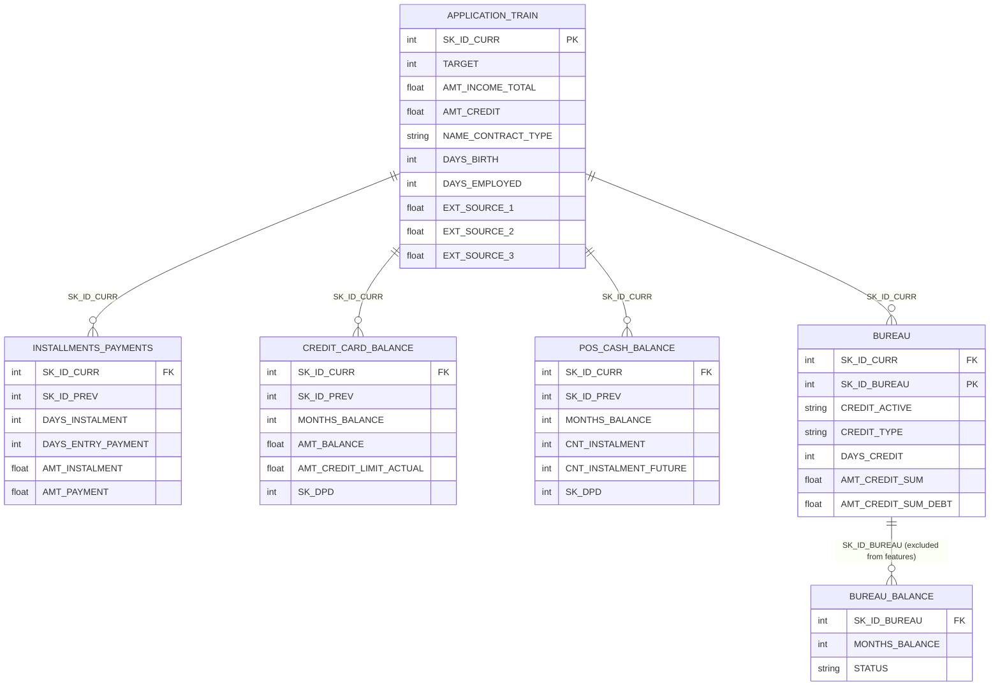

# Entity-Relationship Diagram — Customer 360 Intelligence System

All in-scope tables join back to `application_train` via `SK_ID_CURR`.
`bureau` also carries `SK_ID_BUREAU`, which is the only thing `bureau_balance`
can join on — since `bureau_balance` cannot be linked to an individual
customer without adding that extra hop, it is excluded from `customer_features`
(shown below, dashed, for completeness).

## Join summary

| Table | Grain | Joins to `application_train` via | Used in `customer_features`? |
|---|---|---|---|
| `application_train` | 1 row per customer | — (base table) | Yes |
| `installments_payments` | 1 row per installment | `SK_ID_CURR` | Yes |
| `credit_card_balance` | 1 row per card per month | `SK_ID_CURR` | Yes |
| `POS_CASH_balance` | 1 row per loan per month | `SK_ID_CURR` | Yes |
| `bureau` | 1 row per external credit account | `SK_ID_CURR` | Yes |
| `bureau_balance` | 1 row per external account per month | `SK_ID_BUREAU` (no direct path to `SK_ID_CURR`) | **No** — excluded, see note above |
